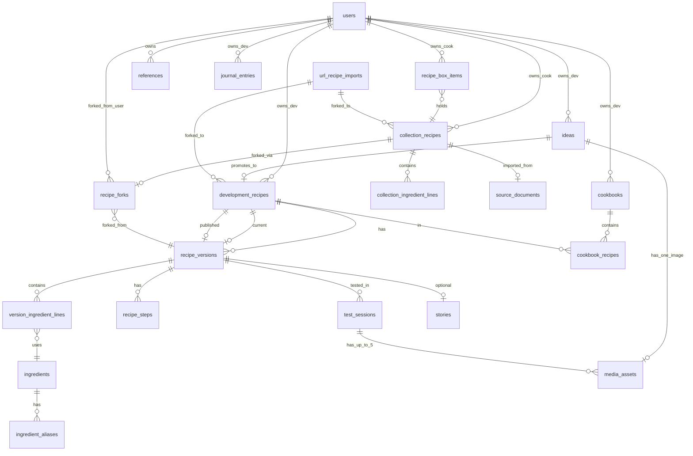

# Trial and Eclair — PRD, Data Model, and Iterating MVP

## Should the PRD come before the stack?

**Yes — establish the PRD and domain model first, then choose stack.**

Requirements drive architecture. Your user stories imply:

- Immutable version snapshots + diff/compare (database design matters)
- Multiple import pipelines (URL, photo, PDF — favors Python or dedicated workers)
- Public read-only views without auth (SSR or static generation helps)
- Optional story + photo attached to recipes (media storage decision)
- Cookbook collections with share links (relational modeling)

Pick stack **after** you confirm MVP scope and data model. Keep only these constraints in mind during PRD work: mobile + desktop web, eventual Python for import/AI, single developer, not urgent.

---

## Part 1 — Inventory: what lives in `[recipes/](recipes/)`

Everything you have today falls into **6 content types** (not all belong in v1):


| Content type              | Sources                                       | Volume (approx)  | Example                                                  |
| ------------------------- | --------------------------------------------- | ---------------- | -------------------------------------------------------- |
| **Raw ideas**             | WIPWIP tabs, Post ideas, Original Notes       | 200+ one-liners  | "Praline topped Blondies", "Chili Cookie - dried pepper" |
| **Categorized ideas**     | WIPWIP taxonomy (Bars, Cookies, Shortbread…)  | 11 category tabs | Shortbread flavor matrix with technique columns          |
| **Development notes**     | `[recipedump.md](recipes/recipedump.md)`      | 1 rich journal   | Rosemary shortbread iterations with gram weights         |
| **Full recipes**          | 8 `.docx` in `Recipes/`                       | 8 files          | English Muffins, Pound Cake, Confetti Cookie             |
| **Reference library**     | Cookbooks tab, Blogs, Pastry Chefs, ReFerence | ~40 entries      | Dorie Greenspan, Kitchn Baking School                    |
| **Attachable narratives** | Post ideas (restaurant, food stories)         | ~15              | Taylor Shellfish review, "First Date at Ana Perna"       |


**Not recipe data (keep out of core schema for now):** blog scheduling notes, photography equipment lists, travel planning, email contacts.

**Seed data migration (Phase 0 task):** import Google Sheets + markdown/txt into structured JSON/CSV seed files; extract `.docx` text in a later pass; store binary originals in object storage.

---

## Part 2 — Data structure options

### Option A — C#-aligned evolution

Extends your existing `[recipes/c# modeling/](recipes/c%23%20modeling/)` entities:

```
Idea ──< Recipe (many rows = versions via VersionNotes)
         └── RecipeIngredient ──> Ingredient (normalized)
Category ──< Idea
SubCategory <──> Idea (many-to-many)
```


| Pros                                                     | Cons                                                              |
| -------------------------------------------------------- | ----------------------------------------------------------------- |
| Familiar from prior ASP.NET work                         | Versioning as duplicate `Recipe` rows is awkward for compare/diff |
| Normalized ingredients enable scaling/substitution later | No cookbooks, publish state, story, or photo in model             |
| Categories match WIPWIP sheet tabs                       | `Method` as rich HTML blob — hard to diff versions                |


**Best if:** you want maximum continuity with the old C# app and plan a careful migration.

---

### Option B — Version-first (recommended core)

Split **identity** from **content snapshots** (from your `[initialbraindump.md](recipes/initialbraindump.md)` MVP schema):

```
recipe_ideas ──promote──> recipes ──< recipe_versions
                              └── published_version_id (stable public snapshot)
cookbooks ──< cookbook_recipes >── recipes
```

- Ingredients/steps stored as **JSONB** on `recipe_versions`: `[{ amount, unit, name, note }]`
- `recipe_ideas` = lightweight capture (WIPWIP one-liners, Post ideas notes)
- Publish = copy `current_version_id` → `published_version_id` + slug
- Story + photo = optional fields on `recipe_versions` or a linked `recipe_story` row (not a blog post)


| Pros                                        | Cons                                               |
| ------------------------------------------- | -------------------------------------------------- |
| Version compare is a diff of two JSONB rows | Ingredient normalization deferred                  |
| Public share link stays stable across edits | Need migration path from C# normalized ingredients |
| Maps cleanly to all 3 personas              |                                                    |
| Matches your prior greenfield plan          |                                                    |


**Best if:** versioning and publish/share are core (they are, per your user stories).

---

### Option C — Content-type split

Separate tables for every distinct thing in your folder:

```
ideas | recipes | versions | test_sessions | cookbooks
stories | references (cookbooks-you-own, blogs, chefs) | source_documents
```


| Pros                                              | Cons                                        |
| ------------------------------------------------- | ------------------------------------------- |
| Mirrors how your spreadsheets are organized today | More tables and joins before anything ships |
| Reference library (40 cookbooks) is first-class   | Over-engineered for MVP                     |
| Import provenance tracked per source file         |                                             |


**Best if:** you want the app to also be your research/reference manager in v1.

---

### Chosen direction: Option C — Content-type split + normalized ingredients

**Decision:** Content-type split (not Hybrid/JSONB). Normalized ingredient catalog is **foundational**, not deferred.

Rationale given your PRD updates and C# prior art (`[Ingredient.cs](recipes/c%23%20modeling/Ingredient.cs)`, `[RecipeIngredient.cs](recipes/c%23%20modeling/RecipeIngredient.cs)`):

- Version diff/compare works on structured `version_ingredient_lines` joined to `ingredients`, not JSONB blobs
- Scaling, substitutions, and future AI pattern recognition need canonical ingredient identity
- Your folder content is already split by type (ideas, references, journals, full recipes) — the schema should mirror that
- Developer vs Home Cook are **different account roles** with different entities and permissions, not UI modes on one account

```
ingredients (catalog)          ideas (developer only)
ingredient_aliases             development_recipes ──< recipe_versions
                               version_ingredient_lines ──> ingredients
                               recipe_steps
                               test_sessions
                               cookbooks ──< cookbook_recipes
                               stories (optional, on publish)

collection_recipes (home cook) recipe_box_items (alphabetical, no categories)
source_documents (import)      references (research shelf — developer, future UI)
recipe_forks (lineage)         users (role + plan tier)
published_snapshots (viewer-facing, denormalized or joined view)
```

Your C# model maps forward: `Idea` → `ideas`, `Recipe`/`RecipeVersions` → `development_recipes`/`recipe_versions`, `RecipeIngredient` → `version_ingredient_lines`, `Category`/`SubCategory` → `box_categories` (home cook) + idea tags (developer).

---

## Part 3 — PRD (Product Requirements Document)

### Product vision

**Trial and Eclair** is a recipe **development and collection** app. It is **not a blog**. Users iterate on recipes with tracked versions, publish finished work, optionally attach a short story and photo, and organize recipes into shareable virtual cookbooks as well as a personal recipe box (all recipes a user has saved.) Viewers read published recipes without an account.    
  
Notes on Frontend design:  
Usability is very important, needs to be easy to edit, enjoyable to use (customizable "notebook" aspect? ). important views - on mobile/tablet: recipe card, full screen landscape. optional voice control for hands free development (roadmap)

### Personas — tiers, roles, and permissions

**Decision:** Home Cook and Recipe Developer are **separate subscription tiers**, implemented as **role-based auth** with a **plan/feature gate**.


|                               | **Home Cook (free)**                                             | **Developer (paid)**                      | **Viewer (no account)** |
| ----------------------------- | ---------------------------------------------------------------- | ----------------------------------------- | ----------------------- |
| **Price**                     | Free, full home cook features                                    | Paid subscription                         | —                       |
| **Primary UI**                | Recipe box (alphabetical list)                                   | Cork board + lab dashboard                | Public published pages  |
| **Organization**              | Recipe box only — **alphabetical sort**, no categories/cookbooks | Ideas board, cookbooks, version history   | —                       |
| **Recipes**                   | Add manually, import URL/photo/PDF                               | Develop with versioning, test sessions    | Read only               |
| **Publish**                   | No public publishing                                             | Publish recipes + cookbooks + story/photo | —                       |
| **Fork/save others' recipes** | Yes — fork into recipe box                                       | Yes — fork into development track         | —                       |


**Is this role-based auth?** Yes — with two layers:

1. **Role** (`home_cook` | `developer`) — determines which entities and routes you can access
2. **Plan/tier** (free | paid) — gates **features** (publish, versioning, cookbooks), not usage caps for now

Implementation: Django/custom user model with `role` + subscription status (Stripe/etc. later). Permission classes check role before version saves, cookbook creation, publish, etc. **No usage limits on free tier initially** — design plan-gate hooks so caps (recipe box size, import quota) can be added later without schema changes.

Upgrading free → paid changes role to `developer`. **Existing recipe box recipes stay** — user gains developer features (ideas board, versioning, cookbooks) without losing collection data. No forced migration of box items to development recipes.

**Home cook recipe box:** single flat list sorted **A–Z by recipe title**. No categories, no cookbooks — keeps the free tier simple. Card aesthetic optional as a display mode, but sort order is always alphabetical.

**Forking recipes from other accounts:**

When a logged-in user (home cook or developer) saves someone else's **published** recipe, they get a **fork** — a copy they can edit — with a permanent link to the original:

```
forked_from_version_id → published version they copied
forked_from_user_id    → original author
fork_type              → "save_to_box" (home cook) | "rework" (developer)
```

- **Home cook fork** → new `collection_recipe` in their recipe box, editable, shows "Based on [Original Title] by [Author]"
- **Developer fork** → new `development_recipe` + v1 `recipe_version`, editable with full versioning from that point; lineage preserved for attribution
- Original author is never modified; fork is independent but attributed
- Matches your braindump: "Fork recipes to make different changes and compare"

**Publishing:** Developer-only. Home cooks consume and fork published content; they do not get share links.


| Persona                     | Goals                                    | Key features                                                     |
| --------------------------- | ---------------------------------------- | ---------------------------------------------------------------- |
| **Recipe Developer (paid)** | Iterate, compare, publish, cookbooks     | Cork board, versions, diff, test notes, cookbooks, fork → rework |
| **Home Cook (free)**        | Personal recipe box; import; fork others | Alphabetical recipe box, manual/import, fork → box, card view    |
| **Viewer**                  | Read shared content                      | Public recipe + cookbook pages                                   |


### User stories (from your notes)

**Recipe Developer**

1. Log in and see my in-progress recipes and ideas (Dashboard is like a cork board with notes pinned up for in progress/current ideas to think about or research)
2. save recipe ideas without making a recipe
3. Create a recipe from an idea or from scratch
4. Save a new version when I adjust ingredients (prior versions preserved)
5. Compare two versions side-by-side (ingredient diff + notes)
6. Mark a version as published; get a shareable link
7. Add an optional story and photo to a published recipe (not a blog post)
8. Group published recipes into a cookbook and share the cookbook link

**Home Cook**

1. Log in (free) and see my **recipe box** sorted alphabetically
2. Add a recipe manually, from URL, photo, or PDF
3. View recipes as **recipe cards** (index-card aesthetic) in alphabetical order
4. **Fork** a published recipe from another user into my box — editable copy, linked to original
5. (No categories, no cookbooks, no publish)

**Viewer**

1. Open a published recipe link without logging in
2. Read ingredients, steps, story, and photo in a clean mobile/desktop layout
3. Browse a published cookbook's recipes

### Decisions for future that affect foundation

**AI context layer (roadmap)** — Yes, this architecture supports it. An "agent context layer" means structured data an AI can query via tools, not raw page text:

- `ingredients` + `version_ingredient_lines` → ratio analysis across versions ("what changed between v2 and v4?")
- `test_sessions` → outcome-linked iteration history
- `references` → cite cookbooks/blogs when suggesting substitutions
- Published recipe corpus → pattern matching across your own library

Build foundation now: normalized ingredients, version snapshots, test session notes. Add an AI service (Python/Django sidecar) in Phase 5+ that exposes tools like `get_version_diff`, `scale_recipe`, `suggest_substitution` against your catalog. No special schema needed beyond what Option C already provides.

**Reference library — what it is**

Separate from recipes, cookbooks, and the recipe box. A **personal research shelf** for baking knowledge that *informs* your work but isn't a recipe itself.

**Access:** **Both home cook and developer** — requires an account. Not public.

**Examples from your data:** cookbooks you own, blogs you follow, pastry chefs you study, articles/tools.

**Schema now, UI in Phase 5+:** `references` + `reference_links`. Seed from Cookbooks/Blogs/Chefs tabs.

---

**Offline editing** — PWA install OK; offline sync later. Requires local IndexedDB cache of collection recipes (home cook) — defer to Phase 5.

Things that this is not:

- Blog platform (scheduling, categories, RSS, comment threads)
- Social network / following / recipe exchange marketplace

### Core entities (Option C — content-type split)




**Ingredient catalog (foundational):**


| Table                         | Purpose                                                                                  |
| ----------------------------- | ---------------------------------------------------------------------------------------- |
| `ingredients`                 | Canonical name, optional `base_ingredient_id` (your C# `baseIngredient`), default unit   |
| `ingredient_aliases`          | Per-user names → canonical; optional default substitution                                |
| `version_ingredient_lines`    | `quantity`, `unit` (standard or custom for developers), `prep_note`, `substitution_note` |
| `collection_ingredient_lines` | Same shape for home cook single-version recipes                                          |


Version compare = diff two sets of `version_ingredient_lines` joined to `ingredients`.

### Key product decisions (locked)


| Decision                  | Resolution                                                                                                                                                                                                          |
| ------------------------- | ------------------------------------------------------------------------------------------------------------------------------------------------------------------------------------------------------------------- |
| Account model             | Role + tier: `home_cook` (free) vs `developer` (paid); 14-day free trial for developer                                                                                                                              |
| Upgrade                   | Same account; recipe box stays when upgrading to developer                                                                                                                                                          |
| Home cook organization    | Recipe box only, alphabetical — no categories                                                                                                                                                                       |
| Publishing                | Developer-only; **public on publish**, can **unpublish** (recipes + cookbooks)                                                                                                                                      |
| Cookbook snapshots        | Recipes added to a cookbook **snapshot at add time**. Unpublishing a recipe does **not** remove it from an already-published cookbook. Remove by editing/unpublishing the cookbook                                  |
| Forking                   | Both tiers fork published recipes; editable copy linked to original                                                                                                                                                 |
| Fork visibility           | **Parental lineage on public pages**; original author can **opt out** of showing forks (`show_forks: false`)                                                                                                        |
| Story                     | **Recipe-attached only** (optional on published version) — not standalone blog posts                                                                                                                                |
| Reference library         | Both tiers, account required — research shelf, UI Phase 5+                                                                                                                                                          |
| Recipe journal            | **Yes** — private chronological dev log; **not shareable**; owner can **edit and delete** entries (confirm on delete). Entry snapshots the recipe state at log time; does not auto-update when new versions publish |
| Recipe layout (public)    | Ingredients in **left column** for now ([kraut-kopf style](http://www.kraut-kopf.de/recipe/shepherds-pie/?lang=en))                                                                                                 |
| Ingredients               | **Hybrid catalog:** global canonical + per-user `ingredient_aliases`                                                                                                                                                |
| Units                     | Standard units + **custom units allowed for developers**                                                                                                                                                            |
| Measurement systems       | **Yes — grams vs cups:** store quantity + unit as entered; user **display preference** (metric / imperial / original); no silent conversion in v1                                                                   |
| Images                    | **Limits:** up to **5 photos per test session**; **1 photo per idea** (idea requires **title**); 1 hero on publish for public page                                                                                  |
| URL import                | Cached read-only `url_recipe_imports` keyed by normalized URL; **same URL = same cached recipe** for all users; **not editable** — fork to own box/dev track; credited to source URL/author                         |
| Scan import               | Photo/PDF of handwritten recipe → OCR → **editable draft** (separate from URL cache)                                                                                                                                |
| Equipment / substitutions | See recommendation below — Phase 4–5                                                                                                                                                                                |
| Free tier limits          | None for now                                                                                                                                                                                                        |
| Admin dashboard           | **Not needed** — cork board covers developer workspace                                                                                                                                                              |
| Challenges / glossaries   | Roadmap only                                                                                                                                                                                                        |
| Payment / pricing         | TBD — decide before **first paid developer signup goes live** (end Phase 2); schema hooks in Phase 0                                                                                                                |
| Stack                     | **Locked:** Django REST + React/TypeScript PWA + Postgres + S3/R2                                                                                                                                                   |
| MVP                       | Phases 0 + 1 + 2 (developer + viewer); home cook Phase 3                                                                                                                                                            |


### Equipment tips and substitutions (#9 recommendation)

Attach at **two levels** — this matches how you actually bake:

1. **Per ingredient line** — `substitution_note` on `version_ingredient_lines` / `collection_ingredient_lines` ("use coconut oil for butter")
2. **Per version** — optional `equipment_notes` text ("stand mixer, 8×8 pan, scale required")

**Why not a separate equipment table yet:** your braindump mentions boxed tips and substitutions inline with ingredients — line-level notes are fastest to build and show in the left-column layout. A dedicated `equipment_items` table can come in Phase 5 if you want structured gear lists. Substitutions on the **ingredient catalog** (`ingredient_aliases` + default subs) come with AI Phase 5.

### URL import safety model (#10)

```
User submits URL → server fetches (rate-limited, sanitized)
                 → parse to structured recipe
                 → store in url_recipe_imports (deduped by normalized URL)
                 → user sees read-only view + "Save to box" / "Rework" / "Add to references"
```

**Safety rules:**

- User-initiated only; server-side fetch with timeout and size limits
- Strip scripts/unsafe HTML; store extracted text/structure only
- Always show **attribution:** source URL, site name, extracted author/byline when available
- **Never publish** a URL import directly as your own — must fork into editable `collection_recipe` or `development_recipe` first
- Same URL returns same cached import (shared across users) — consistent attribution, less re-scraping
- Respect `robots.txt`; block private/auth URLs; log fetch failures gracefully
- Optional: refresh cache on demand (developer) with "last fetched" timestamp

**Scan import (photo/PDF):** OCR pipeline → editable draft owned by user — no shared cache, no read-only lock.

### Recipe journal (#8)

Private `journal_entries` for developers:

- Chronological log linked to a `development_recipe` + optional `recipe_version` snapshot
- **Not shareable**, not public
- Owner can **edit** notes and **delete** entries (with confirmation)
- Snapshot frozen at entry time — publishing a new version to a cookbook does not rewrite past journal entries
- Cork board shows active ideas; journal is the **timeline** of what you tested and when

### Cork board scope (#16 — no separate admin dashboard)

The cork board **is** the developer workspace. It includes:

- Pinned ideas (title + 1 image each)
- Quick capture new idea
- Status: researching / testing / ready to publish
- Links to active development recipes and recent test sessions
- Optional filter by category tag (from WIPWIP taxonomy)

Does **not** need a separate admin dashboard unless you later want site-wide moderation (multi-tenant admin) — out of scope for solo/small product.

### Images (#11)


| Context                       | Limit    | Notes                       |
| ----------------------------- | -------- | --------------------------- |
| Idea (cork board)             | 1 photo  | **Title required**          |
| Test session                  | 5 photos | Per bake/test iteration     |
| Published recipe              | 1 hero   | Public share page           |
| Collection recipe (home cook) | TBD      | Likely 1; decide in Phase 3 |


Store in object storage; enforce limits in API.

### Developer trial (#15)

14-day free trial on developer tier before paid subscription required. Implement Stripe (or similar) before trial ends in production — schema: `trial_ends_at`, `subscription_status` on user from Phase 0.

---

## Part 4 — Iterating MVP (phased roadmap)

You said you're not in a rush — this is a **multi-phase build**, each phase shippable.

### Phase 0 — Foundation (schema + seed, no UI)

- Full Option C schema including `ingredients`, aliases, both recipe tracks
- Role-based auth (`developer` | `home_cook`)
- Seed: Sheets + txt/md → structured import; docx text extraction
- Seed ingredient catalog from existing recipe data (recipedump weights, docx)

### Phase 1 — Developer core

- Developer registration + cork board dashboard (ideas pinned)
- `ideas` CRUD without creating a recipe
- Promote idea → `development_recipe` + v1 `recipe_version`
- Ingredient catalog autocomplete + `version_ingredient_lines`
- Explicit "Save new version" + `version_notes`
- `test_sessions` on versions (basic notes)

### Phase 2 — Publish + Viewer

- Publish → public `/r/[slug]`; unpublish supported
- Left-column ingredient layout on public pages
- Optional story + hero photo on publish
- Parental fork lineage on public pages (author can hide forks)
- Cookbook add = **snapshot** published version at add time

### Phase 3 — Compare, cookbooks, home cook (free tier)

- Version diff (developer)
- Cookbooks publish `/c/[slug]`; unpublish cookbook; entries are snapshots
- Recipe **journal** (private, edit/delete)
- Home cook: registration, recipe box, manual entry, fork
- Reference library UI (both tiers)
- 14-day developer trial + subscription wiring

### Phase 4 — Import pipelines

- **URL import:** read-only shared cache + fork-to-edit + attribution
- **Scan import:** photo/PDF OCR → editable draft
- Equipment/substitution notes on ingredient lines
- Fork buttons on public pages

### Phase 5 — Polish + roadmap

- PWA installability, offline sync
- Ingredient-level substitution intelligence + AI tools
- Challenges, glossaries (roadmap)

**Revised MVP:** Phases **0 + 1 + 2** — full schema with normalized ingredients; developer can iterate, version, publish; viewer can read. Home cook is Phase 3+ (not blocked by schema — tables exist from Phase 0).

---

## Part 5 — Stack (locked)


| Layer    | Choice                                                                             |
| -------- | ---------------------------------------------------------------------------------- |
| Backend  | **Django REST** + Python                                                           |
| Frontend | **React / TypeScript** PWA                                                         |
| Database | **Postgres**                                                                       |
| Media    | **S3 / Cloudflare R2**                                                             |
| Auth     | Django + role/plan permissions; Stripe for trial/subscription (before prod launch) |
| Jobs     | Celery or Django-Q for URL fetch + OCR (Phase 4+)                                  |


---

## Part 6 — Mapping your folder → seed data


| Source                         | Maps to                                                                         |
| ------------------------------ | ------------------------------------------------------------------------------- |
| WIPWIP tabs                    | `ideas` + category tags (developer seed)                                        |
| WIPWIP "MAKE" tab              | `ideas` with `status: active`                                                   |
| Post ideas sheet               | `ideas` + `stories` candidates                                                  |
| Cookbooks / Blogs / Chefs tabs | `references` (seed only, UI later)                                              |
| `recipedump.md`                | `development_recipe` + versions + `test_sessions` + ingredient lines            |
| `.docx` recipes                | `development_recipe` or `collection_recipe` + ingredient lines after extraction |
| Restaurant/story notes         | `stories` linked to future published versions                                   |


---

## Next steps

1. ~~Pick data model~~ → Option C + normalized ingredients
2. ~~Personas~~ → Free home cook / paid developer + fork lineage
3. ~~Free tier limits~~ → None for now
4. ~~MVP scope~~ → Phases 0–2 developer + viewer
5. ~~Stack~~ → Django REST + React + Postgres + R2
6. ~~PRD decisions~~ → See locked table above
7. **PRD sign-off** → confirm and begin Phase 0 seed migration
8. **Payment pricing** → decide before first prod developer signup (~end Phase 2)

