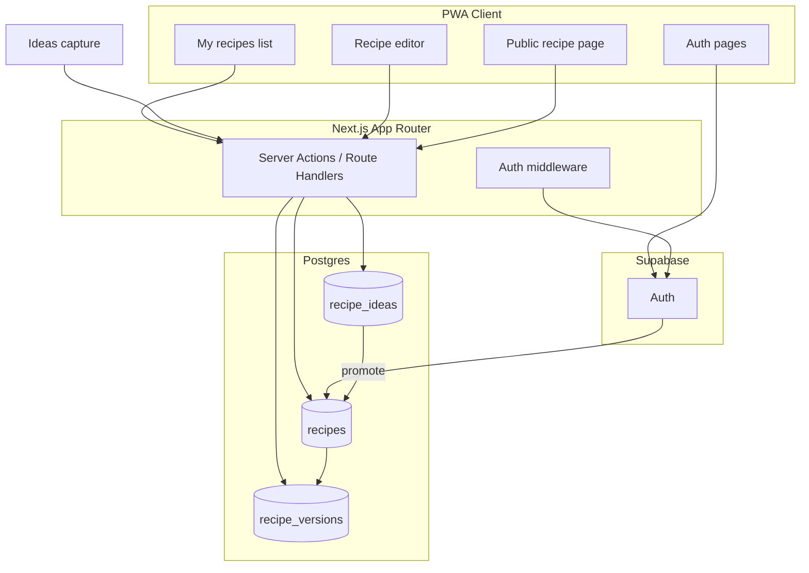

Update the plan options to take into consideration the following:

some user stories:

A recipe developer logs into their account where they can 1. develop recipes by iterating through small adjustments of the ingredients. these changes are tracked with versioning, and can be compared to determine the best recipe 2. they can publish finished recipes. they can collect recipes into a virtual cookbook. and publish/share the cookbook
it's not a blog, but you can add a story connected to the recipes and a photo.
It is not a blog. 

A home cook logs into their account where they keep their recipe collection. they can upload recipes in multiple ways, or manually type them out
they can view the recipes as cards that are reminicent of a recipe card. Or an organized collection. 

A viewer does not have a login, but they're able to see published recipes. 


I want an iterating plan. I'm not worried about needing to use it right away. 
help me establish a PRD
then an MVP from that 
should the PRD be established before the stack? 

also for reference previous modeling is in the 'c# modeling' folder. 

-- collect all recipes and recipe ideas from the recipes folder into a useful set of data. give me some data struction options to pick from so I can ask questions.


-----

good for web and mobile


the original https://github.com/wolpino/trialandeclair

Equipment you’ll need
Add boxed in tips, or substitutions
How to separate recipe from writing, or don’t?
Figure out how to put ingredients in column on left. Ingredients on side: http://www.kraut-kopf.de/recipe/shepherds-pie/?lang=en 
Currently being tested?


Trial and eclair

Recipe
id: int
title: str
ingredients: Ingredient[]
images: json blog image links
description: str 
//BaseType: cookie/brownie/bar cookie/
Recipe steps: simple, more detail > ordered list?
Published

Recipe test
Results


Ingredient
Id
Unit
baseIngredient 
Quantity


Users have...
Recipes

Fork recipes to make different changes and compare. 

ADMIN DASHboard VIEW cook/baker focus view options
-- Ideas/concepts/to bake/inspo board 
-- recipe journal (like a cook book, but in chronological order and the recipe in the journal doesn't get updated when new versions are published (to the cookbook) >> private/public
-- cookbooks - options to look at other cookbooks, exchange recipe cards, save favorite recipes.

ADMIN recipe: includes blog url or cookbook reference. Screen capture like tearing out a page in a magazine, not editable but convertible into a recipe

ai model to suggest tweaks to recipes

Challenges
Glosseries

Versioning,

The Kitchen’s New Sous Chef

Think of AI as that culinary sous chef: perfect recall, no taste buds. It’s like the ultimate sous chef that has analyzed tens of millions of recipes, but one that has never experienced the apparent joys of enjoying fresh bread out of the oven. The system may, for example, recognize patterns across thousands of chocolate chip cookie recipes in an instant; still, it won’t reveal to you if yours needs a pinch more of salt. Your experience is the key piece because AI lacks senses. For now.

    “AI isn’t replacing creativity in the kitchen — it’s amplifying it by handling the tedious calculations and research.”

In researching the evolution of rugelach recipes in American Jewish cookbooks, I employed AI to help analyze how the pastry transformed from a yeasted Hungarian kipfel to the cream cheese-based cookie we know today. This helped identify key pattern shifts in ingredients and techniques across decades of cookbooks, from The Settlement Cookbook to Maida Heatter’s rugelach recipe which became the baseline recipe for the American style of rugelach.

    Pattern Recognition: Analyze ingredient ratios across successful recipes
    Scaling Mathematics: Adjust measurements with precise calculations
    Substitution Intelligence: Suggest evidence-based alternatives
    Process Documentation: Structure testing notes and observations
    Research Synthesis: Compile historical and cultural context


    1. The Scaling Challenge

Scenario: Converting a beloved family cookie recipe from 12 to 50 servings

Traditional Method: Manual multiplication, often leading to awkward measurements and potential errors

2. The Substitution Solver

Real Example: Creating a dairy-free ice cream recipe

Traditional Approach: Trial-and-error experimenting with milk alternatives and stabilizers

3. The Testing Tracker

Instead of scattered notes, use AI to organize your testing process:

When developing fusion recipes, AI can help you understand traditional techniques and flavor combinations:

Prompt: "Compare traditional Mexican mole sauce techniques 
with Japanese curry roux preparation methods. Identify common
elements and key differences in spice blooming and thickening approaches. 

 historical significance of sourdough bread in 
San Francisco, including its Gold Rush origins and scientific understanding 
of the local wild yeast strains."

add new recipe from url
scan photo of recipe
scan recipe from PDF
manual recipe add

share recipes as cookbooks

PREVIOUS PLAN

---
name: Recipe App MVP
overview: Scaffold a mobile-first PWA with Next.js for recipe ideas (description-only), recipe CRUD (draft/edit/delete), and publish-to-link sharing. Cookbooks and layout variants come in a later iteration.
todos:
  - id: scaffold-next
    content: Initialize Next.js 15 + TS + Tailwind + shadcn/ui; add PWA manifest scaffolding
    status: completed
  - id: supabase-schema
    content: Create Supabase project, recipe_ideas + recipes + recipe_versions migration, RLS, env example
    status: completed
  - id: auth-flow
    content: Implement Supabase Auth (login/signup), middleware, protected /recipes layout
    status: in_progress
  - id: ideas-crud
    content: Add recipe_ideas table, quick-capture UI, promote-to-recipe flow
    status: pending
  - id: recipe-crud
    content: Build server actions + list/new/edit pages with dynamic ingredients/steps
    status: pending
  - id: publish-share
    content: Add publish/unpublish, slug generation, public /r/[slug] page with OG metadata
    status: pending
  - id: pwa-deploy
    content: Add service worker/installability, deploy to Vercel, update README
    status: pending
isProject: false
---

# Recipe Development App — MVP Plan

## Context

[trialandeclair2](https://github.com/wolpino/trialandeclair2) is a greenfield repo (README only). You chose a **responsive web PWA** and **recipes-only** scope for v1: save, edit, delete, publish → shareable link. Cookbooks and recipe-card vs cookbook layouts are explicitly deferred.

## Recommended stack

| Layer | Choice | Why |
|-------|--------|-----|
| Framework | **Next.js 15** (App Router) + TypeScript | SSR/OG for share pages, fast mobile UX, one codebase |
| Styling | **Tailwind CSS** + shadcn/ui | Mobile-first components, consistent forms/lists |
| Database | **Supabase (Postgres)** | Auth + DB + RLS in one place; good fit for “my drafts vs public published” |
| ORM (optional) | **Drizzle** or raw Supabase client | Drizzle if you want typed migrations; Supabase client is enough for MVP |
| Hosting | **Vercel** + Supabase project | Zero-config deploy; env vars for Supabase URL/keys |
| PWA | `next-pwa` or `@serwist/next` | Installable app, basic offline shell (full offline editing is post-MVP) |



## Data model (MVP)

Split **identity/publish state** from **recipe content** so versioning is a natural extension, not a migration rewrite.

### `recipes` (stable identity)

| Column | Type | Notes |
|--------|------|-------|
| `id` | uuid PK | Stable recipe id |
| `user_id` | uuid FK → `auth.users` | Owner |
| `status` | enum `draft` \| `published` | Default `draft` |
| `slug` | text unique nullable | Set on first publish; stable share URL |
| `current_version_id` | uuid FK → `recipe_versions` | Version being edited (MVP: always latest) |
| `published_version_id` | uuid FK nullable → `recipe_versions` | Snapshot shown on public link |
| `published_at` | timestamptz | Set when status → `published` |
| `created_at` / `updated_at` | timestamptz | |

### `recipe_versions` (content snapshots)

| Column | Type | Notes |
|--------|------|-------|
| `id` | uuid PK | |
| `recipe_id` | uuid FK → `recipes` | Parent recipe |
| `version_number` | int | 1, 2, 3… unique per recipe |
| `title` | text | Required |
| `description` | text | Optional |
| `ingredients` | jsonb | `[{ amount, unit, name }]` |
| `steps` | jsonb | `[{ order, body }]` |
| `prep_minutes` / `cook_minutes` | int | Optional |
| `created_at` | timestamptz | Immutable snapshot time |

Unique constraint on `(recipe_id, version_number)`.

**MVP behavior (simple, versioning-ready):**
- **Create:** insert `recipes` + `recipe_versions` v1; set `current_version_id`.
- **Edit:** update the row pointed to by `current_version_id` in place (no version history UI yet).
- **Publish:** set `status = published`, copy `current_version_id` → `published_version_id`, set `published_at`, assign `slug` if missing.
- **Public page:** join `recipes` → `published_version_id` → `recipe_versions` (not `current_version_id`, so draft edits do not change the live share until republish).

**Row Level Security (RLS):**
- `recipes`: owner CRUD via `user_id = auth.uid()`.
- `recipe_versions`: allow access only when `recipe_id` belongs to the authenticated user (policy via subquery/join on `recipes.user_id`).
- Public read: `recipes` where `status = 'published'`, joined to `published_version_id` content only.

**Slug generation:** On publish, generate a URL-safe slug from title + short random suffix (e.g. `chocolate-chip-cookies-a3f2`). Slug lives on `recipes` and stays stable across future versions.

### `recipe_ideas` (lightweight capture — separate from recipes)

**Recommendation: use a separate table, not a third `status` on `recipes`.**

| Approach | Verdict |
|----------|---------|
| `status = idea \| draft \| published` on `recipes` | Avoid — mixes unrelated lifecycles; forces empty `recipe_versions` rows, nullable slug/version FKs, and publish rules that do not apply to a one-line note |
| Separate `recipe_ideas` table | **Preferred** — description-only shape, no versioning/publish noise, clear **Promote to recipe** transition |

| Column | Type | Notes |
|--------|------|-------|
| `id` | uuid PK | |
| `user_id` | uuid FK → `auth.users` | Owner |
| `description` | text | Required; only field user fills for MVP |
| `promoted_recipe_id` | uuid FK nullable → `recipes` | Set when user promotes; idea can stay for history or soft-hide from active list |
| `created_at` / `updated_at` | timestamptz | |

**RLS:** same owner-only pattern as `recipes` (`user_id = auth.uid()`).

**Promote to recipe** (`promoteIdeaToRecipe(ideaId)`):
1. Create `recipes` row (`status = draft`).
2. Create `recipe_versions` v1 with `description` copied from idea; `title` defaults to first line of description or `"Untitled recipe"` (user edits on full editor).
3. Set `current_version_id`; set `recipe_ideas.promoted_recipe_id`.
4. Navigate to `/recipes/[id]/edit`.

Ideas are **never publishable** and have **no share link**. Publishing remains `draft → published` on `recipes` only.

**Why not `status = idea`?** `draft` and `published` describe a *developed recipe’s* visibility. An idea is pre-recipe content with a different shape and no version history—treating it as status would leak idea-specific logic into every recipe query, validator, and public route.

## Versioning path (post-MVP, low friction)

The schema above is intentionally shaped for full versioning without breaking share links:

| Future feature | How it maps |
|----------------|-------------|
| New version on edit | Insert `recipe_versions` with `version_number + 1`; point `current_version_id` at it; leave `published_version_id` unchanged until user republishes |
| Version history UI | List rows for `recipe_id` ordered by `version_number` |
| View old published snapshot | Public link always reads `published_version_id`; optional `/r/[slug]?v=2` later |
| Compare versions | Diff two `recipe_versions` rows (same jsonb shape) |
| Roll back | Set `current_version_id` to an older version id (or clone row as new version) |

What we **avoid** in MVP (but do not paint ourselves into): storing title/ingredients/steps directly on `recipes`, or overwriting published content on every save.

## Routes and pages

| Route | Purpose | Auth |
|-------|---------|------|
| `/` | Marketing / sign-in CTA | Public |
| `/login`, `/signup` | Email magic link or password (Supabase Auth) | Public |
| `/recipes` | List with tabs/filters: **Ideas** \| **Recipes** (draft + published badges) | Required |
| `/ideas/new` | Quick capture — description only (large textarea, save) | Required |
| `/ideas/[id]/edit` | Edit / delete idea; **Develop recipe** (promote) | Required (owner) |
| `/recipes/new` | Create full recipe (skip idea step) | Required |
| `/recipes/[id]/edit` | Edit / delete / publish | Required (owner) |
| `/r/[slug]` | **Public share page** for published recipe | Public |

Publish flow on edit screen:
1. User taps **Publish** → validate title + at least one ingredient/step.
2. Set `status = published`, assign `slug` if missing, set `published_at`.
3. Show copyable link: `{APP_URL}/r/{slug}`.
4. **Unpublish** (optional for MVP): revert to `draft`, keep slug reserved or clear slug—recommend keeping slug to avoid broken links if republished.

Delete: hard delete row (MVP); confirm dialog on mobile.

## UI (mobile-first)

- **Bottom nav** on authenticated shell: Kitchen (list) | Add (sheet: **New idea** \| **New recipe**) or separate Ideas entry.
- **Ideas list:** compact cards showing description preview (2–3 lines); tap to edit; **Develop recipe** CTA on card or detail.
- **Recipe list:** card rows with title, status chip, last updated; swipe or overflow menu for delete (or edit screen only for MVP simplicity).
- **Editor:** single-column form—title, description, dynamic ingredient rows, numbered steps, optional prep/cook times; sticky **Save** / **Publish** actions.
- **Public page (`/r/[slug]`):** clean readable layout (title, meta, ingredients, steps)—styled like a simple recipe card; no account required. Add Open Graph meta for link previews in iMessage/WhatsApp.

Defer: cookbook grouping, alternate “cookbook layout,” print stylesheet, rich text, images (can add `image_url` column in v1.1).

## Auth

- **Supabase Auth** with email (magic link or password—magic link is less friction on mobile).
- Next.js **middleware** protects `/recipes/*`; redirect unauthenticated users to `/login`.
- Session via `@supabase/ssr` cookie helpers (App Router pattern).

No multi-user collaboration or roles in MVP.

## Project structure (to scaffold)

```
trialandeclair2/
├── app/
│   ├── layout.tsx              # root + viewport + PWA meta
│   ├── page.tsx                # landing
│   ├── login/page.tsx
│   ├── recipes/
│   │   ├── page.tsx            # tabbed list: ideas + recipes
│   │   ├── new/page.tsx
│   │   └── [id]/edit/page.tsx
│   ├── ideas/
│   │   ├── new/page.tsx
│   │   └── [id]/edit/page.tsx
│   └── r/[slug]/page.tsx       # public share (generateMetadata for OG)
├── components/
│   ├── recipe-form.tsx
│   ├── idea-form.tsx
│   ├── recipe-list.tsx
│   └── ui/                     # shadcn
├── lib/
│   ├── supabase/               # server + browser clients
│   ├── recipes.ts              # CRUD + publish helpers
│   └── ideas.ts                # idea CRUD + promote
├── supabase/migrations/        # schema + RLS policies
├── public/manifest.json
└── .env.local.example          # NEXT_PUBLIC_SUPABASE_URL, keys
```

## Implementation sequence

### Phase 1 — Foundation
- Initialize Next.js (App Router, TS, Tailwind, ESLint).
- Add Supabase project; migration for `recipe_ideas`, `recipes`, `recipe_versions` + RLS policies.
- Wire Supabase Auth (login/signup/logout) and protected layout for `/recipes/*`.

### Phase 2 — Ideas + recipe CRUD
- Server actions for ideas: `createIdea`, `updateIdea`, `deleteIdea`, `promoteIdeaToRecipe`.
- Quick idea capture UI; tabbed or filtered list on `/recipes`.

### Phase 2b — Recipe CRUD
- Server actions: `createRecipe`, `updateRecipe` (writes `current_version`), `deleteRecipe`, `getRecipesForUser`, `getRecipeById` (joins current version for editor).
- List page + editor with client-side dynamic ingredient/step fields.
- Optimistic or toast feedback on save/delete.

### Phase 3 — Publish and share
- `publishRecipe(id)` → set status, slug, `published_at`, `published_version_id = current_version_id`.
- Public `/r/[slug]` page (server component) + `generateMetadata`.
- Copy-link UI on edit screen after publish.

### Phase 4 — PWA polish
- `manifest.json`, icons, theme color, `apple-mobile-web-app-capable`.
- Service worker for installability (optional: cache public recipe pages).
- Smoke test on iOS Safari and Android Chrome (viewport, tap targets ≥ 44px).

### Phase 5 — Deploy
- Vercel project + env vars; Supabase redirect URLs for auth.
- Document local setup in README (replace the current 2-line stub).

## Security checklist

- RLS enabled on `recipe_ideas`, `recipes`, and `recipe_versions`; never expose service role key to client.
- Public routes only query `status = published`.
- Validate ownership in server actions before update/delete/publish.
- Rate-limit auth endpoints via Supabase defaults.

## Explicitly out of MVP (later iterations)

- **Version history UI** (create new version on save, list/compare/restore)—schema supports it; MVP only edits `current_version` in place
- Cookbooks (collections) and cookbook-style share pages
- Recipe-card vs cookbook **layout toggle** on publish
- Recipe images, tags, search, fork/clone
- Social features, comments, accounts without auth
- Full offline draft editing

## Success criteria

- Signed-in user can capture, edit, and delete ideas (description only) and promote an idea into a draft recipe.
- Signed-in user can create, edit, and delete recipes on a phone-sized viewport.
- Draft recipes are private; published recipes open at `/r/[slug]` without login.
- Share link works when pasted in another browser/device.
- App is installable as PWA from mobile browser.

## Estimated effort

~2.5–3.5 focused days: ~0.5d foundation/auth, ~0.25d ideas, ~1d recipe CRUD UI, ~0.5d publish/public/OG, ~0.5d PWA + deploy + README.

flowchart TB
  subgraph client [PWA Client]
    AuthPages[Auth pages]
    MyRecipes[My recipes list]
    Editor[Recipe editor]
    PublicView[Public recipe page]
  end
  subgraph next [Next.js App Router]
    ServerActions[Server Actions / Route Handlers]
    Middleware[Auth middleware]
  end
  subgraph supabase [Supabase]
    Auth[Auth]
  end
  subgraph db [Postgres]
    Ideas[(recipe_ideas)]
    Recipes[(recipes)]
    Versions[(recipe_versions)]
  end
  AuthPages --> Auth
  MyRecipes --> ServerActions
  IdeasList[Ideas capture]
  IdeasList --> ServerActions
  Editor --> ServerActions
  PublicView --> ServerActions
  Middleware --> Auth
  ServerActions --> Ideas
  ServerActions --> Recipes
  ServerActions --> Versions
  Auth --> Recipes
  Recipes --> Versions
  Ideas -->|promote| Recipes
